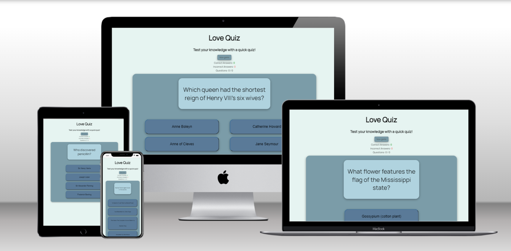

# Love Quiz

Love Quiz is an interactive website for people who love quizzes.
It contains questions from multiple areas of knowledge: history, chemistry, literature etc. Each question has four answer options to choose from.
This website targets adults and curious children with diverse interests and a love for games.

## Features 

### Wireframe

### Existing Features

- __The Header__

  - The header shows the name of the game and contains a message encouraging to play.

- __Score area__
  - There is a link that looks like a button that restart the game;
  - Contains separate counter for correct answers and counter for wrong answers;
  - Area also contains functionality that reflect the number of current questions in relation to the total number of questions.

  

- __Question Area__

  - Contains question clearly visible through contrasting font on a light pleasing-to-eye background. New questions appear automatically after the previous one has beeng answered because of JavaScript code.
  - When I play quiz games as a user, I find it irritating to perform additional clicks to "Play" or "Next Game" buttons. I choose not to add these buttons and to use a delay of displaying the next question.

- __Answers Section__

  - Contains four buttons with answer options. When the user chooses the right answer button change background colour to green. If the player chose the wrong answer button change background colour to red. After the user clicks on the button, a new question appears.
  - On smaller screens four buttons line up in a column.

### Features Left to Implement
- Where there is time, I would like to add table score and more questions. 

## Technologies

- JavaScript
  - The mechanics of the website was implemented using a javascript, which ensured interactivity

- HTML
  - The structure of the website was developed using HTML as the main language.

- CSS
  - The website was styled using custom CSS in an external file in separate folder.

- GitHub
  - Was used as a workspace for developing of the website.

- GitPod
  - Tool used to commit and push code to GitHub during the development of the website.

- Git
  - Tool used to commit and push code to GitHub during the development of the website.

## Testing 

- This quiz game website weas tested on Google Chrome and Microsoft Edge browsers.
- The website is responsive, looks good and functions on all standard screen sizes implemented in the devtools device toolbar.
- Lighthouse testing from Google Chrome device toolbar confirms that website is accesible and has exelent performance.

- Lighthouse shows 100% Accessibility on mobile test as well.

### Validator Testing 

- HTML
  - No errors were returned when passing through the official [W3C validator](https://validator.w3.org)

  When I play quiz games as a user, I find it irritating to perform additional clicks to "Play" or "Next Game" buttons. I choose not to add these buttons and to use a delay of displaying the next question.

- CSS
  - No errors or warnings were returned when passing through the official [(Jigsaw) validator](https://jigsaw.w3.org/css-validator/)

  

- JavaScript
  - No errors were found when passing through the JavaScript Validator.
[JSHint](https://jshint.com/)
 

## Fixed Bugs 
- There was a problem with the if statement condition in checkAnswer function. During the session with the mentor, it became clear that the reason was in strict comparison operator. After changing it from "====" to "==" the function began to be executed.

- Also, there was a problem with displaying of changing the background colour of the answer buttons. During the tutor session tutor explained that I wouldn't be able to see colour change without setting the timeout method first.

- There was a problem with the ability to select multiple answers for each question. The user must be able to select only one answer, but they had the opportunity to choose several options simultaneously.

After my first submission of this project, the assessor gave me several pieces of advice in the assessment result letter regarding how I could fix this bug and overall improve my code by using isAnswering variable and if statement in checkAnswer function.

## Unfixed Bugs
- No unfixed bugs.

## Deployment

- Website was created using the GitPod code editor and pushed to GitHub to the remote repository ‘love-quiz’.
- Website was deployed to GitHub pages.

The live link can be found here - https://alinapanasenko.github.io/love-quiz/

## Credits 

- runGame and getNextQuestion functions were adapted from James Q Quick tutorial "Build a Quiz App", part 3, which you can find by this link: [Build a Quiz App (3) - Display Hard Coded Questions](https://www.youtube.com/watch?v=zZdQGs62cR8&t=359s&ab_channel=JamesQQuick)
- checkAnswer function was performed with help from the mentor and the assessor.
- Incrementing score for right and wrong answers was copied from the Love Math Project of Code Institute.
- To make the link for the new game to look like a button I used the guide from this post on stackoverflow:
[stackoverflow](https://stackoverflow.com/questions/23608346/how-to-style-a-div-like-the-button-element)

### Content 

- Questions and answers were found by Google on the Internet.
